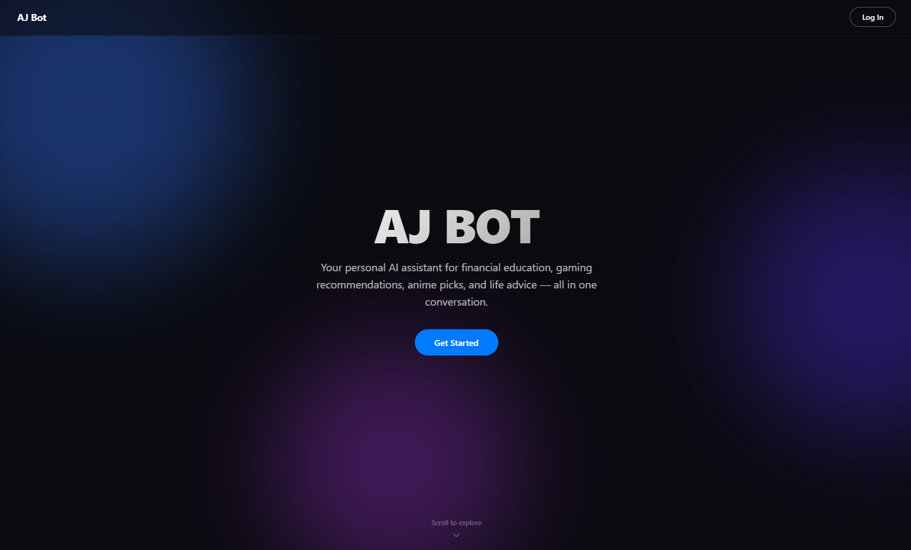
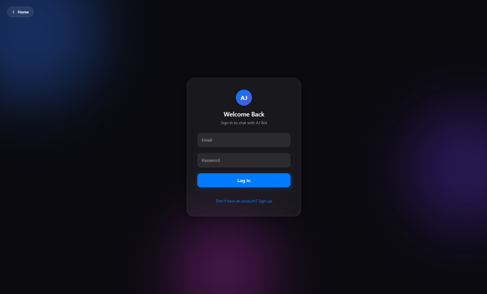
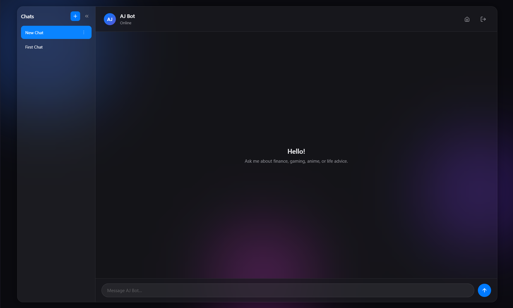

# AJ Bot — AI Chat Assistant

An AI-powered chatbot built with Google's Gemini 2.5 Flash model, featuring a modern dark-themed UI with Firebase authentication and multi-conversation support.

---

## Screenshots

<!-- 
HOW TO ADD SCREENSHOTS:
1. Take screenshots of your pages (landing, login, chat)
2. Create a folder called "screenshots" in your project root
3. Drop the images in there (e.g. landing.png, login.png, chat.png)
4. Uncomment the lines below and they will display in your README

Alternatively, drag & drop images directly into the README editor on GitHub — 
it will auto-upload them and generate the markdown for you.
-->

<!--  -->
<!--  -->
<!--  -->

---

## What It Does

AJ Bot is a full-stack AI chatbot that uses **Google's Gemini 2.5 Flash** large language model to have conversations across four domains:

- **Financial Education** — ETFs, budgeting, investing concepts, retirement accounts
- **Gaming Recommendations** — MMORPG suggestions based on playstyle preferences
- **Anime Recommendations** — Suggestions based on genre, tone, and favorites
- **Life Advice** — Practical guidance on habits, motivation, and personal growth

The Gemini model receives a custom system prompt (defined in `CLAUDE.md`) that gives AJ Bot its personality and expertise boundaries. Each conversation's full message history is sent to the model, so it maintains context across the entire chat.

---

## How It Works

```
┌──────────────┐       HTTPS        ┌──────────────────┐       API Call       ┌─────────────────┐
│   Frontend   │  ───────────────►  │  Flask Backend   │  ─────────────────►  │  Google Gemini  │
│  (HTML/JS)   │  ◄───────────────  │   (API.py)       │  ◄─────────────────  │   2.5 Flash     │
└──────────────┘    JSON responses  └──────────────────┘   AI-generated text  └─────────────────┘
       │                                    │
       │        Firebase Auth               │        Cloud Firestore
       │◄──────────────────────►            │◄──────────────────────►
       │   (login / signup)                 │   (store conversations
       │                                    │    & messages per user)
```

1. **User signs in** via Firebase Authentication (email/password)
2. **Frontend sends messages** to the Flask backend with a Firebase ID token
3. **Backend verifies the token**, loads conversation history from Firestore, and builds the full context
4. **Gemini 2.5 Flash** receives the system prompt + conversation history and generates a response
5. **Response is saved** to Firestore and returned to the frontend
6. **Frontend renders** the AI response with full Markdown support (code blocks, lists, bold, etc.)

---

## Tech Stack

| Layer | Technology |
|-------|-----------|
| **AI Model** | Google Gemini 2.5 Flash via `google-genai` SDK |
| **Backend** | Python, Flask, Flask-CORS, Gunicorn |
| **Authentication** | Firebase Auth (email/password) |
| **Database** | Cloud Firestore (per-user conversation storage) |
| **Frontend** | Vanilla HTML, CSS, JavaScript |
| **Markdown** | marked.js for rendering AI responses |
| **Design** | Dark theme with animated gradient blobs, frosted glass UI |

---

## Features

- Multi-conversation sidebar with create, rename, and delete
- Collapsible sidebar with smooth animation
- Full Markdown rendering in AI responses (code, lists, headings, blockquotes)
- Typing indicator while waiting for AI response
- Per-user data isolation via Firebase Auth + Firestore security
- Always-dark theme with animated gradient blob backdrop
- Landing page with scroll-reveal animations
- Responsive design for mobile and desktop

---

## Project Structure

```
├── index.html          # Landing / homepage
├── web.html            # Chat application (auth + chat UI)
├── style.css           # All styles for auth & chat pages
├── landing.css         # Landing page styles
├── landing.js          # Landing page scroll effects
├── chat.js             # Chat logic, sidebar, conversations
├── auth.js             # Firebase auth (login, signup, logout)
├── API.py              # Flask backend (Gemini AI, Firestore, auth)
├── CLAUDE.md           # System prompt — AJ Bot personality & rules
├── requirements.txt    # Python dependencies
├── .env.example        # Template for environment variables
└── .gitignore          # Blocks secrets from version control
```

---

## Setup (Local Development)

### 1. Clone the repo
```bash
git clone https://github.com/YOUR-USERNAME/AI-Engineering-API-and-JSON-.git
cd AI-Engineering-API-and-JSON-
```

### 2. Install Python dependencies
```bash
pip install -r requirements.txt
```

### 3. Set up environment variables
```bash
cp .env.example .env
```
Edit `.env` and add:
- `GOOGLE_API_KEY` — your Gemini API key from [Google AI Studio](https://aistudio.google.com/apikey)
- `FIREBASE_CREDENTIALS` — path to your Firebase service account JSON file

### 4. Set up Firebase
- Create a project at [Firebase Console](https://console.firebase.google.com)
- Enable **Email/Password** authentication
- Create a **Cloud Firestore** database
- Download the service account key and save as `serviceAccountKey.json` in the project root

### 5. Run the backend
```bash
python API.py
```

### 6. Open the frontend
Open `index.html` in a browser (or use Live Server in VS Code)

---

## License

This project is for educational purposes.